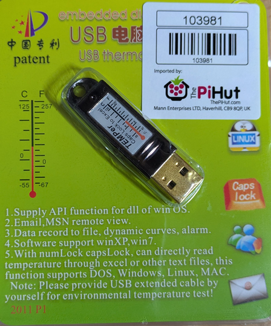

# tempergoldwin
Python module to read TEMPer Gold USB temperature sensor on Windows.

Link to [purchase] (https://thepihut.com/products/temper-gold-original-usb-temperature-sensor).

# TEMPerGoldWin Python Module

This module allows reading temperature from TEMPer Gold USB devices on Windows.

## Installation

1. Install `pywinusb`:
2. Download or clone this repository and import the module in your Python script:

```python
import tempergoldwin
print(tempergoldwin.read_temperature())
```



